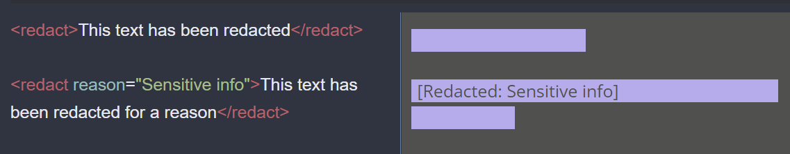
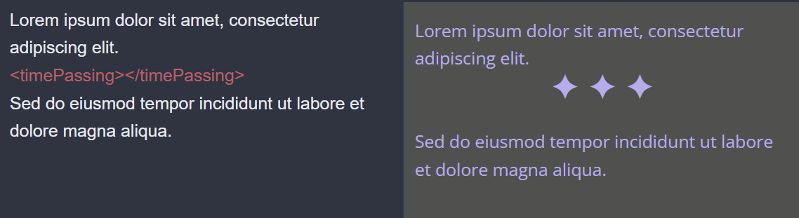

# Custom CSS Themes for Joplin
[Joplin](https://joplinapp.org/) is an open-source markdown notetaking app. I've mostly used joplin for journaling and notetaking, so this is a collection of CSS themes that I've created to optimize my workflow and make Joplin more visually appealing.

Joplin's appearance can be customized with CSS coming from two files: `userstyle.css` and `userchrome.css`. `userstyle.css` controls the rendered markdown in the viewer and HTML/PDF exports. `userchrome.css` controls the the editor and overall app styles. These CSS customizations override existing Joplin styles, so you can add as little or as much as you want.

To use any of these themes just copy them into the Joplin-Desktop directory and change the file name to `userstyle.css` or `userchrome.css` corresponding to the style type.

**CONTENTS**

- userstyle.css Themes
	+ Custom HTML Tags
	+ Theme Previews
	
- userchrome.css Themes

- Installation / How To use
---

# userstyle.css
Each `userstyle.css` template has either "Notes" or "Journal" in the title, so use whichever one bet fits your use case. The only real difference is that I use block code as a header block for journal entries, but I use it for code in notetaking.

## Custom HTML Tags
Markdown supports HTML tags using `<>` brackets, so I've added support for various custom tags:

### Redact
The `<redact>` tag will redact the enclosed text and make it unreadable. The `reason` attribute can be used to display a message before the redacted text.

### Spoiler
`spoiler` is a subclass of `redact`. The text will still be hidden at first, but if you hover over it the text will reveal itself. Similarly to the `reason` attribute, the `warning` attribute can be used to give a content warning to your spoilered text.

### Hidden
`hidden` is another subclass of `redact`, which will make the text fully disappear instead of being blotted out.

### Flags
Flags can be used to determine specific handling of the redact tag depending on the content being redacted. For instance, if you wrap text in `<redact flag="restricted-access"> </redact>`you can choose how instances of this flag are handled in your CSS. You would use the header `flag~="restricted-access"]{` and then you can fill in rules to determine whether or not this text shows up or not. You could also use this to apply other styles if you want, for example if you wanted all mentions of a specific topic to show up in a certain color. The handling for a few different cases are listed above the flag section in comments. "Display like normal" will do nothing to the wrapped text. "Redact" will follow the usual redact procedure and replace the text with a dark block. "Hide" will remove the text without replacing it with anything so readers wouldn't know it was ever there.

### Time Passing
`<timePassing></timePassing>` is an easy way to generate the big ellipsis that can act as a divider or signify time passing.

### Hover Content (in development)
The `<hoverContent>` tag can be used to embed content to text that shows up as a pop-up box when the user hovers over the text. The content of the box is determined by the `content=""` attribute of the tag. The implementation of this tag isn't quite right, but it's still useable and future versions will be smoother.
